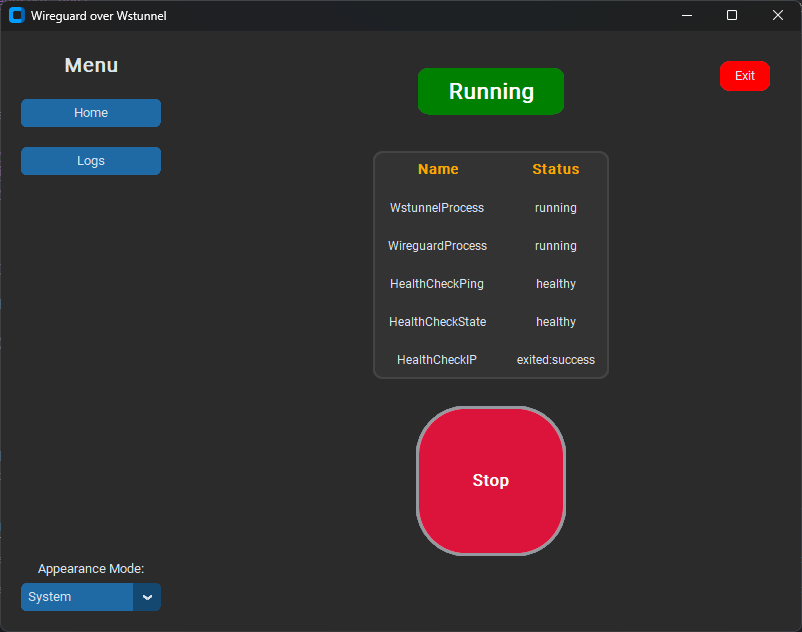

# Wireguard over wstunnel (TCP)

## About The Project

This is a python application that quickly and easily enables the use of wireguard over TCP using [wstunnel](https://github.com/erebe/wstunnel)



## Getting Started

### Prerequisites

This script require the following software to be installed / downloaded:

- [python3](https://www.python.org/downloads/)
- [wstunnel](https://github.com/erebe/wstunnel/releases)
- [wireguard](https://www.wireguard.com/install/)

### Installation

 _Using pyinstaller binaries_

1. Download latest [release](https://github.com/klementng/wireguard-over-wstunnel/releases/) binary
2. Change permissions (for linux systems)

    ```sh
    chmod +x ./main 
    ```

3. Edit the [config.yml](./config.yml)
4. Start the program (double click on windows)

    ```sh
    ./main 
    ```

_Using source code_

1. Download latest [release](https://github.com/klementng/wireguard-over-wstunnel/releases/) source code
2. Extract zip file
3. Install required packages

   ```sh
   pip install -r requirements.txt 
   ```

4. Edit the [config.yml](./config.yml)
5. Start the program

   ```sh
   python main.py
   ```

<p align="right">(<a href="#readme-top">back to top</a>)</p>

## Command Line Usage

Additional Options:

```text
usage: main.py [-h] [--config CONFIG] [--clean] [--export] [--nogui] [--log_level LOG_LEVEL]

Wireguard over wstunnel

options:
  -h, --help            show this help message and exit
  --config CONFIG, -c CONFIG
                        path to program config
  --nogui               start with no gui
```

<p align="right">(<a href="#readme-top">back to top</a>)</p>

## License

Distributed under the MIT License. See `LICENSE.txt` for more information.

<p align="right">(<a href="#readme-top">back to top</a>)</p>

## Icons

- <a href="https://www.flaticon.com/free-icons/pipe" title="pipe icons">Pipe icons in (assets/icon) created by Freepik - Flaticon</a>
